

<h1 align="center">Tyag</h1>
<!-- 

 -->

## Getting Started
Do you find yourself forgetting your precious Sogans, Jaap, and other vital Jain practices? Reconnect with your spiritual essence using the **Tyag** app – your ultimate companion for a mindful and disciplined spiritual journey.

### APK
[⬇️ Download apk here](https://raw.githubusercontent.com/Shreyans13/tyag-webpage/main/build/apk/tyag-the-fasting-app.apk?token=GHSAT0AAAAAACHBOKTPJC5BIOI4J4ZWQESQZMDB4CQ)

## Some Features
 **Sogans Recording** Effortlessly capture and revisit your spiritual affirmations.

 **Jaap Counter** - Ensure your devotion stays consistent with mindful repetition.

 **Fastings & Austerity Tracker** - Stay disciplined and achieve your spiritual goals.

 **Samayik Meditation Log** - Record moments of reflection to enhance mindfulness.

 **Maun (Silence) Timer** - Embrace the power of silent contemplation.

 *More features* - More features like Jaap, Samayik etc comming soon

### Show some :heart: and :star: the repo to support the project. 

## Screenshots

### Mobile
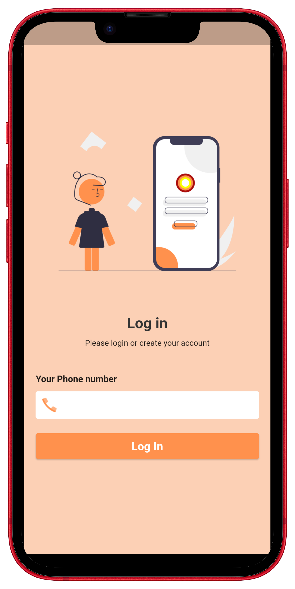 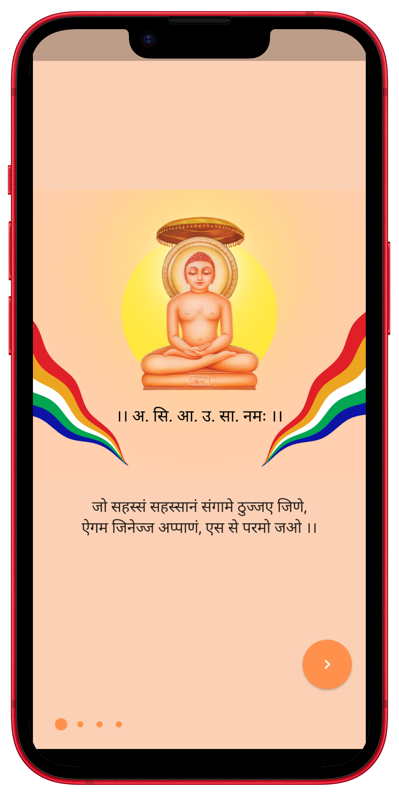 
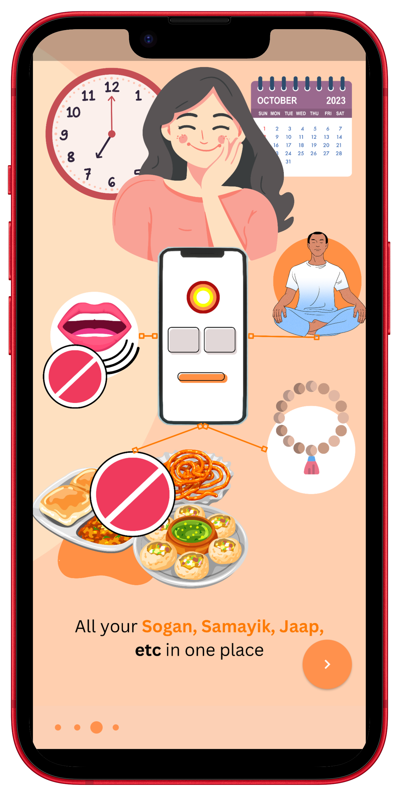 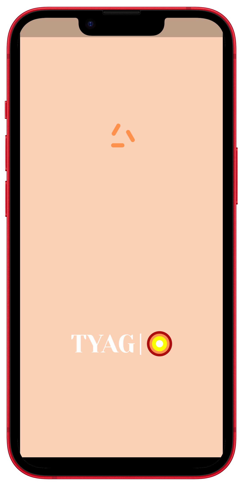 
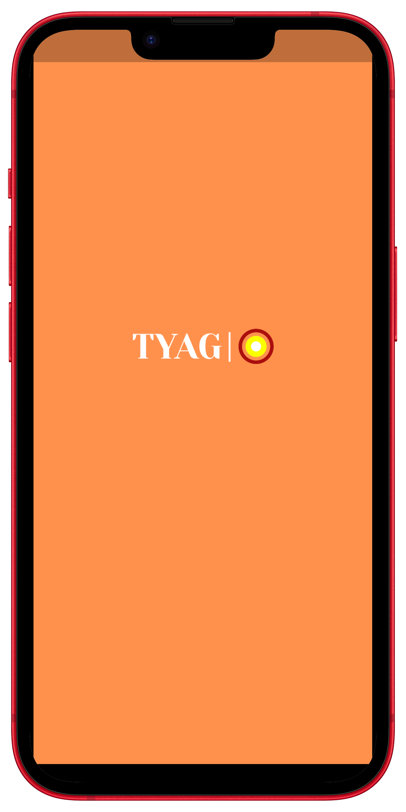 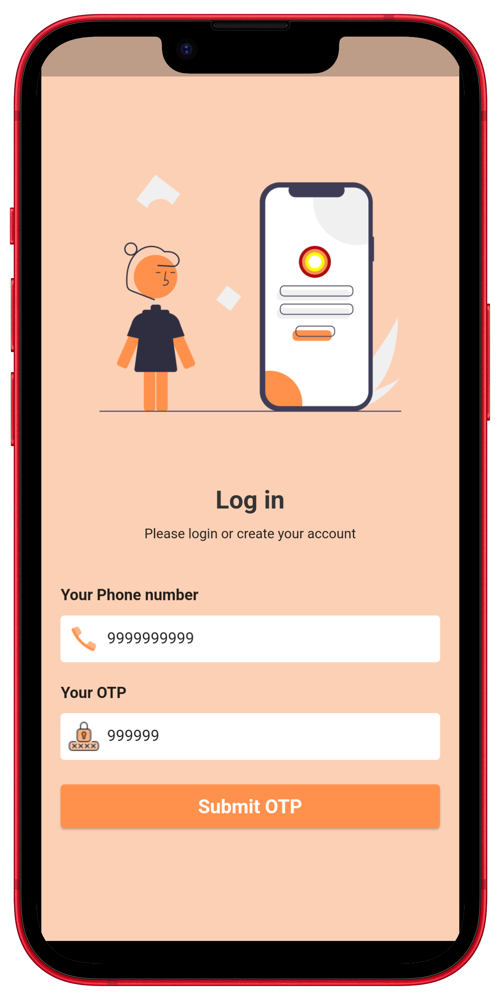 
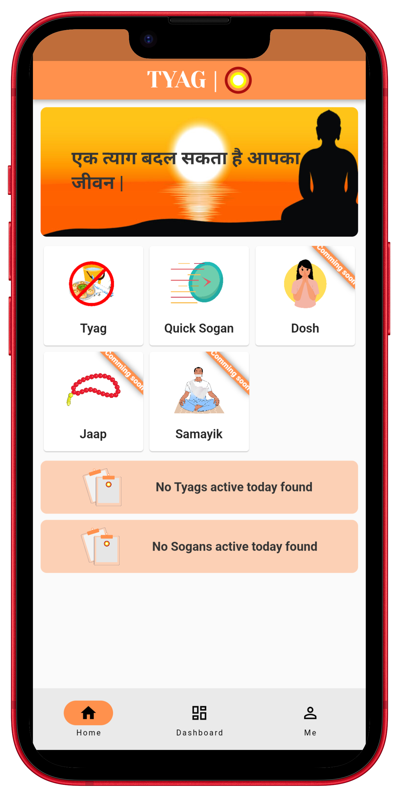 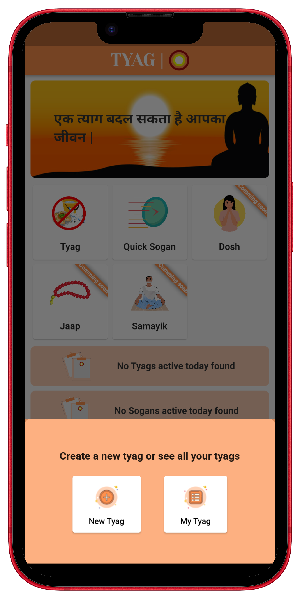 
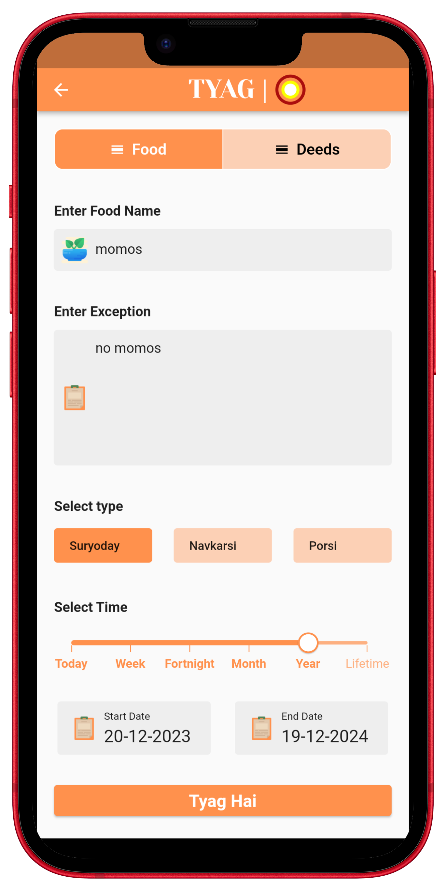 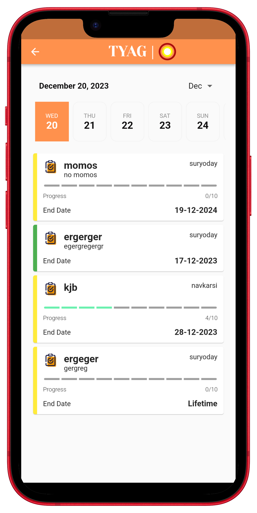 
 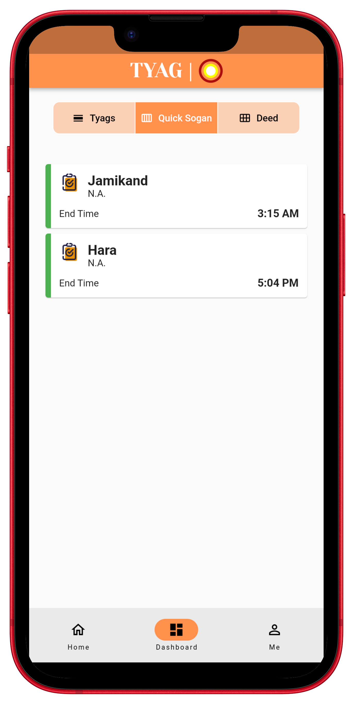
 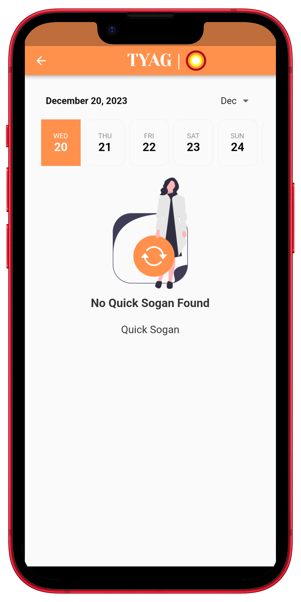 
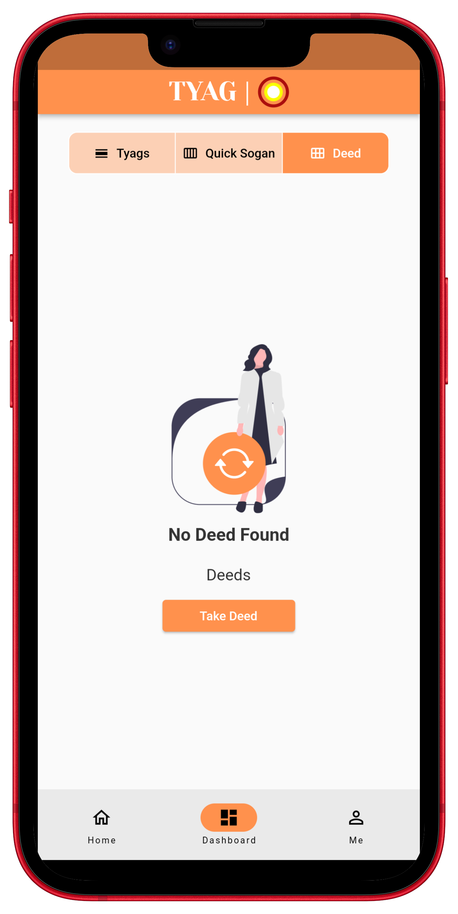 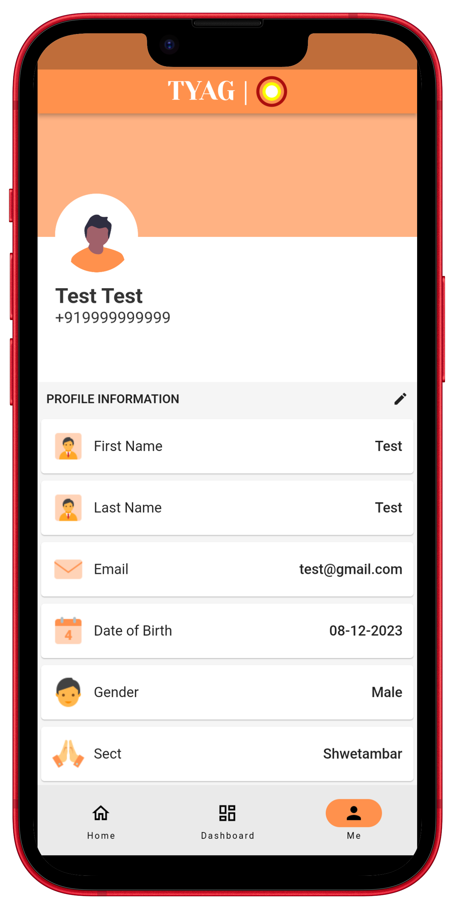 

## Facing Any Problem with the application or page need any Help :grey_question:
Incase you face any problem or need any help write me in [issues](https://github.com/Shreyans13/tyag-webpage/issues) section. 

To learn more contact at saranshdugarmi2@gmail.com or shreyans.13.dev@gmail.com

